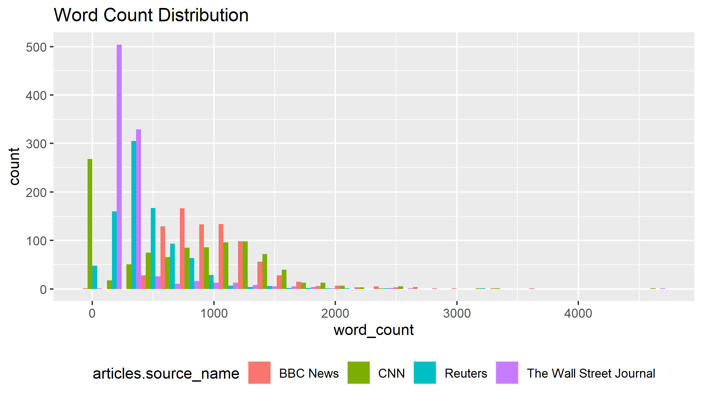
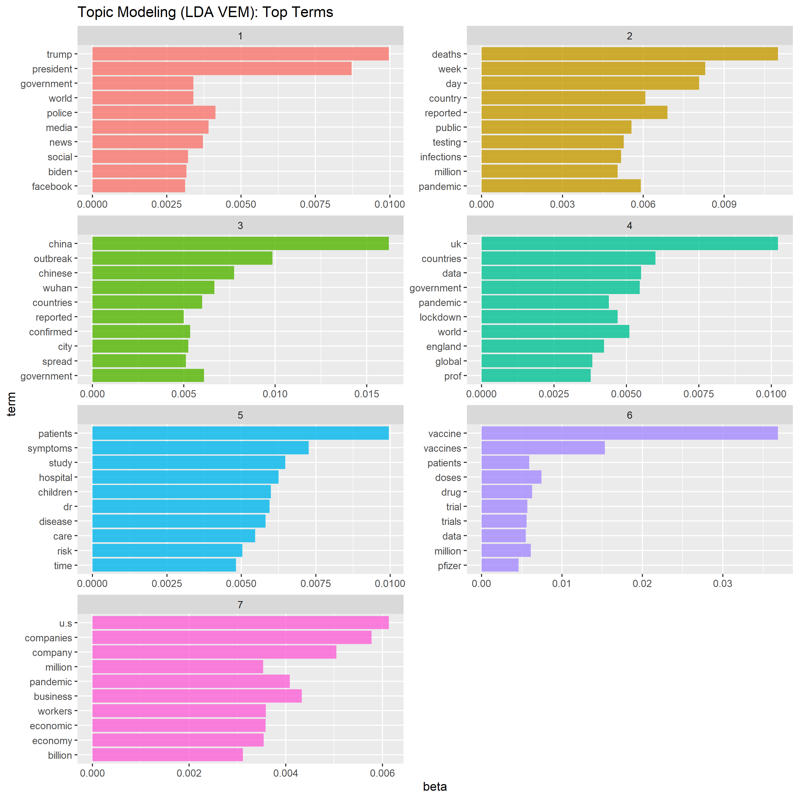
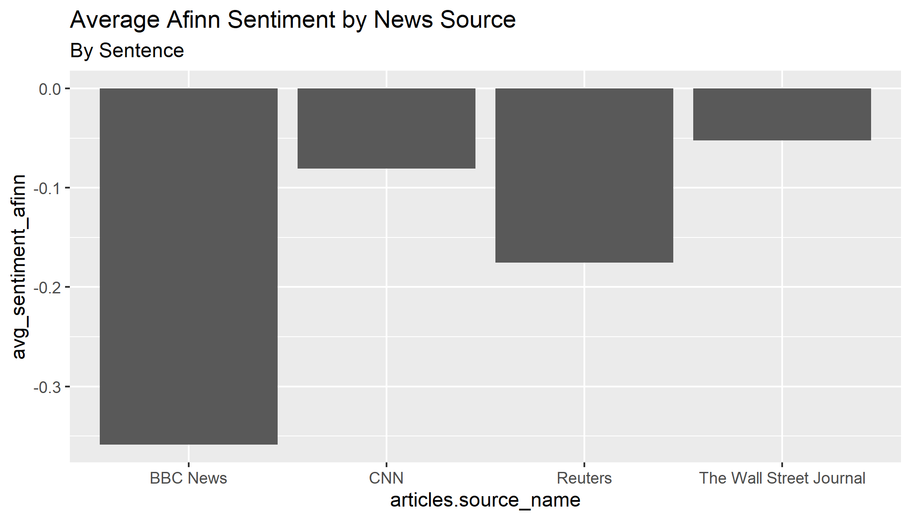
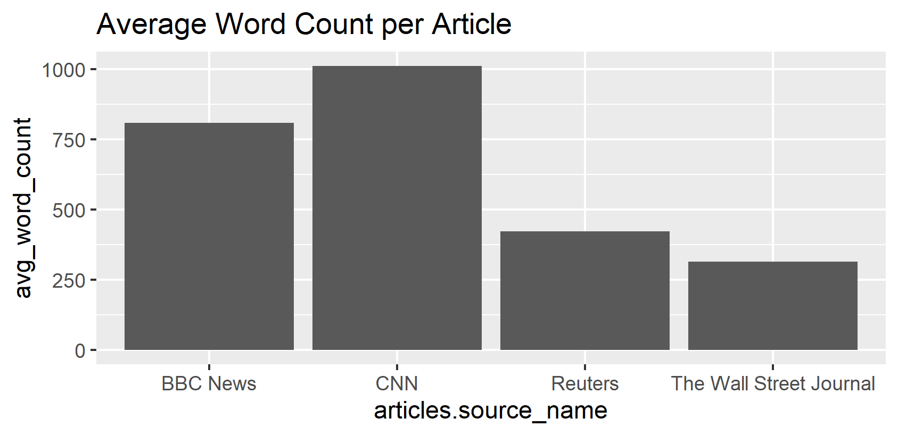

```{r, include=FALSE}
# not run
# setwd("C:/Users/apagta950/Documents/NYU/Courses/Spring 2021/MDML/Final Project/US-News-NLP/results")

library(knitr)
library(readr)

knitr::opts_chunk$set(fig.pos = "!H", out.extra = "")
model_results <- "../figures/model_results.csv"
```

\newpage

# Preface

The full code and dataset can be found here: https://github.com/ajpag/US-News-NLP

All analysis was completed in R.

# Research Question

## Background

The means in which informaton is communicated with regards to the COVID-19 pandemic
has had major influence on how we read and learn about the virus through a multitude 
of media outlets. Some of these major sources include television, YouTube, social 
media forums, and major news companies. Major news companies in particular carry large
influence based on the audiences it can reach. For example$^{1/}$, Fox News Channel 
averaged 2.5 million primetime viewers (8pm - 11pm) in February 2021, and CNN 
averaged 1.7 million during the same time period.

*Source: https://www.foxnews.com/media/fox-news-finishes-february-most-watched-primetime-network*.

According to King G.$^{2/}$ & et. al., *"...the exposure to news media causes Americans to take public stands on specific issues, join national policy conversation, and express themselves publicly"*. Furthermore, Holman E.$^{3/}$ & et. al, suggest a correlation between raising level of stress and  
prolonged media exposure to "community-based traumas (e.g., mass shootings, natural disasters". 
Recently, Holman$^{4/}$ has suggested the COVID-19 is a particular case to study; since multiple stressors
have arose at the same time. To mention some: financial crisis, elections, health crisis, among others.It can be said that news can influence the decisions, general views and metal health of Americans.

*Source: https://science.sciencemag.org/content/358/6364/776*

*Source: https://www.pnas.org/content/111/1/93*

*Source: https://www.universityofcalifornia.edu/news/how-and-why-coronavirus-changing-our-sense-time*

  *Source: https://www.bbc.com/future/article/20200512-how-the-news-changes-the-way-we-think-and-behave*


The large influence that major news companies have on how information is commmunicated to its audiences, and 
the impact news have on its readers makes it vital to quantify how different these sources are in relation 
to COVID-19 news. By measuring potential bias in relation to each source, this analysis examines how different 
major news sources are when reporting on COVID-19. It also explores underlying patterns 
such as subtopics within COVID-19 that are published more in news sources over others. And if these patterns
are predictive of which news source the article came from. 

## Research Question

Are there underlying patterns in news articles related to COVID-19 across major news
sources that suggest bias, and are these patterns predictive of which news 
source it is likely from?

## Use Cases

By quantifying underlying differences on COVID-19 reporting and examining the 
predictive power of these patterns to identify the news source, this study can be 
useful for a number of cases. For example, understanding biases in article text 
can help the reader understand inherent idealogical leanings towards certain news 
sources, which can help equip them with greater understanding and critical 
examination of news consumption. In the same way, selective news consumption could
potentially lead to less stress impact due to news sources.

From a policy perspective, greater impact and studies could be done to influence transparency$^{6/}$ in reporting across the news companies.
In order to make inform decisions on which news sources to read. 

*Source: https://www.americanpressinstitute.org/journalism-essentials/bias-objectivity/understanding-bias/*

# Data

## Data Sourcing

In order to choose major news sources to analyze, the figure below  created by 
the Pew Research Center shows where on the US political spectrum various 
news companies fall. In order to get a mix of sources across the conservative and 
liberal spectrum, while balancing limitations of computing resources, the following 
news sources were used to procure a dataset. 


*Source: https://www.journalism.org/2014/10/21/political-polarization-media-habits/pj_14-10-21_mediapolarization-08/*

- BBC

- CNN

- The Wall Street Journal

- Reuters

*Note: Due to legal restrictions, Fox News data was not scraped*

```{r setup, include=FALSE}
setwd("C:/Users/apagta950/Documents/NYU/Courses/Spring 2021/MDML/Final Project/US-News-NLP/results")
knitr::opts_chunk$set(echo = TRUE)
```

## Data Cleaning

Leveraging the **[GNews API](https://gnewsapi.net/)**, news article data related 
to COVID-19 were pulled for the following major news sources noted in the 
previous section (filtered to US articles).

### GNews API

A total of 5,360 articles between the time period 1/1/2020 - 4/9/2021 were called from 
the API (20 articles per week and news source, for 67 weeks). The API call returned 
3,454 records for article-related data. Below are some of the key fields from the 
API call, with an example:

- ```article url```: https://www.cnn.com/2021/02/08/health/covid-19-antigen-tests-states-cnn-analysis/index.html

- ```article description```: "Covid-19 antigen tests not counted among cases in some
 states, CNN analysis shows - CNN "

- ```date and time of article publication```: 2021-02-08T08:00:00Z

- ```article source name```: CNN

### Web Scraping

After gathering the article URLs, the full news text for each article was pulled. Each
data source carried unique idiosyncrasies in its html structure. The next section 
highlights unique aspects web scraping each data source. 

#### BBC

BBC news articles used different HTML structures based on each section. Hence, we have used keyword function in “Gnews API” to extract articles only in “news” tab. It allows to scrap all body text, but also advertisement as well as unnecessary information. As a result, it was necessary to remove irrelevant lines and words to prevent these features from affecting on our analysis.


#### CNN

There were two distinct HTML structures. One for the first sentence, and another 
for the remainder of the article. Additional cleaning needed to be done to remove 
the "(CNN)" and "(CNN Business)" text at the beginning of each article, as well as additional escape
characters scattered throughout the article.

#### Reuters

This was relatively streamlined compared to the other news sources. One unique 
aspect of Reuters was that a number of their articles were not text articles in the 
traditional sense, but slideshows. For example this article:

https://www.reuters.com/news/picture/coronavirus-outbreak-spreads-in-china-idUSRTS2ZART

#### The Wall Street Journal

Our original plan was to extract articles from conservative newspaper, “Fox news”. However, we have changed it to Wall Street Journal as “Fox news” updated their Terms of Use which strictly forbidden to use *“…any automated means, including "robots," "spiders," or "offline readers"…”*.One downside of using Wall Street Journal was that it is a subscribe-based website; it allows ordinary viewers to extract a fraction of articles. It explains the small amount of average word count per article comparing to other newspapers such as BBC or CNN.Similar to BBC, scraped body text contained lots of irrelevant information and it is removed with further cleaning process.


# Methodology

## Exploratory Data Analysis

### Sentiment Analysis

To better understand the data, sentiment analysis utilizing various lexicons were 
explored. Key visualizations of the data are illustrated:

BBC had the least average words per article, whereas CNN had the most words per 
article.



BBC News had a larger variety of top words compared to the other news sources.


All news sources had average weekly sentiment mainly hovering between -1 to 0, using the Afinn lexicon. This means that average sentiment was slightly negative.

The Wall Street Journal had the largest range in average weekly sentiment. It is 
plausible there is some correlation between this sentiment and the stock market, and
would require further analysis outside of this study.

*Afinn lexicon: https://www.tidytextmining.com/sentiment.html*


## Feature Engineering

In order to create features to build classification models for predicting a 
news source based on text, the below features were generated.

### Average Sentiment and Word counts

One feature was generated for each article:

- average sentiment by word
- average sentiment by sentence
- word count
- word count with a sentiment

### Keyword features

As a baseline, keyword features based on the researchers' assumptions on the 
following topics was used to generate average Afinn sentiment for articles. One 
feature was generated for each term below (noted in quotes).

- Politics: "Trump", "Biden"

- Business: "stock market", "financial"

- Pandemic: "death", "pandemic", "disease", "illness"

### Topic features from prior research

We have introduced several new features which has been defined and researched previous published papers to increase our model’s predictability:

- First paper by Hart, Chinn and Soroka  introduced a dictionary, which assembled major words with the most relevant vocabularies such as Covid-19, Scientist, Republican and Democrat, to explore politicization and polarization in pandemic news in the U.S. newspapers from March to May 2020. 

- Second paper by Green et al demonstrated that absolute difference in the proportion of words used by political party using Tweet data from January to March 2020.

-	Final paper by Schaeffer also shows the difference in views on various topic based on their political stands from January and Feb 2021.

The new features will compute the frequency of these list of words used in each article. Since these features are not extracted nor inferred from our collected article data but rather the result from a broader analysis, we can expect that these features can enhance our model’s performance on the dataset that we did not use.

Source: "Politicization and Polarization in COVID-19 News Coverage"
https://journals.sagepub.com/doi/full/10.1177/1075547020950735

- COVID 19

- Scientist

- Republican

- Democrat

Source: "Polarization in elite communication on the COVID-19 pandemic"
https://advances.sciencemag.org/content/6/28/eabc2717

- Republican Words

- Democrat Words

## Topic Modeling: Latent Dirichlet Allocation

To assess commonalities in topics and article text across articles, Latend
Dirichlet Allocation was applied. After experimentation, it was decided that 
7 topics was the optimal number, based on interpretabilty and overlap of topics. 
The VEM method was used: 
https://www.tidytextmining.com/topicmodeling.html

Topics:

```{r, echo=FALSE, warning=FALSE, message=FALSE}
library(knitr)
topics_ <- data.frame(topic_number = 1:7,
                      topic = c("Politics", "Reported deaths and cases",
                                "China / Wuhan", "Outbreaks and infections by country",
                                "Patients and Symptoms", "Vaccines and Research",
                                "Business and Economy"))
kable(topics_, caption = "Topics from LDA")

```




# Measuring Bias Across News Sources

Performing a chi-square test to measure differences in signifances across news sources,
the following metrics were used. The chi-square test for all three metrics suggest 
that there is a indeed a bias in article text across the news sources.

## Topic Probabilities

Following intuition, The Wall Street Journal has the highest average topic 
probability for Business and Economy articles. It is interesting that Reuters has 
the highest probability of China / Wuhan related articles. CNN has the lowest 
probability of articles pertaining to vaccines and research.

The chi-square test (*p < 1%*) indicates there are correlations across each news source in
relation to average topic probabilities.

*Note: Probabilities were multiplied by a factor of 100 prior to running the test*


## Average Sentiment

The chi-square test (*p < 1%*) indicates there are correlations across each news source 
in relation to average Afinn sentiment.

*Note: Sentiment scores were multiplied by a factor of 100 and converted to positive integers prior to running the test*



## Word Count


The chi-square test (*p < 1%*) indicates there are correlations across each news source 
in relation to average word count.

*Note: Average word counts were converted to positive integers prior to running the test*



# Classification

For each of the 5 algorithms run, 4 models were run using different sets of 
features:

- **Topic Modeling features**: per section 5.4 

- **Keyword features**: per section 5.2

- **Topic keyword features**: per section 5.3

- All features

# Results

## Conclusion

Assessing bias using the chi-square test per section 7 suggests that there is strong evidence 
that the article text varies significantly across news sources.

Of all the models we ran, the random forest using all features performed the best (90% accuracy, 
98%). The models that performed least favorably were Naive Bayes and Support Vector Machine. 
The random forest model performed the best because it is a non-parametric model without strong 
assumptions. Since the news sources have inherent topics they are more likely to write about, such as business for WSJ, the random forest can model these patterns more strongly vs. other models such 
as logistic regression.

Naive Bayes and Support Vector Machine did not perform well for a number of reasons:

- Strong assumptions: Naive Bayes assumes independence of features, which is not the case in our data

- Binary vs. Multi-class predictions: The two models are better suited for binary classifications, 
as opposed to multi-class problems

- Boundary splitting: Naive Bayes and SVM perform better when the data structure naturally splits 
the data to accurately classify the news source. Since the data does not have clear patterns that 
these two algorithms can split the data, it does not perform as well.

The feature importance for the best model, Random Forest (all features), are 
shown in the below figure. 

The most predictive feature was probability topic 7 (Business and Economy), 
which best split Wall Street Journal from the other news sources.


### Limitations:
- Selection bias in news articles analyzed: Due to legal 
restrictions, more conservative news sources, such as Fox News, were not scraped.
Also due to legal restrictions, the articles of The Wall Street Journal were not 
able to be fully scrapped. 

- Context limitations in sentiment: The sentiment method used, Afinn, only parsed 
words individually, and not into context of the entire article. So, the sentence 
sentiment was calculated using the average sentiment of words. 

- Parsing limitations: There are many edge cases in which breaking down 
articles by sentences did not parse successfully. For example, 
```tidytext::unnest_functions()``` incorrectly parsed the following sentence into 
two since ```Ms.``` has a period: 

Original sentence:
```"The manager's decision to send Ms. Coleman home for wearing the headscarf was due to a lack of training," Warren said.```

Parsed sentence(s)

- ```"The manager's decision to send Ms."```

- ```"Coleman home for wearing the headscarf was due to a lack of training," Warren said."```

-	Calculating sentiment scores from news articles to predict the publisher may not be an effective mechanism. Our research question hypothesized that the average sentiment of articles from each newspaper on a single phenomenon is not equal. It is true that each newspaper has its own perspectives in general. However, it is difficult to detect and to measure these patterns based on each article’s sentiment; news articles are mostly written with an objective and logical tone. It would be more comprehensible if we focus on the headline of the articles  or data from social network service such as Facebook or Twitter as they are more likely to include emotional words. In this paper, the researchers used machine learning models that we used to predict three major sentiments based on Twitter data with a higher accuracy.  

-	Another issue is related to newspaper’s several differences in their nature. Firstly, Wall Street Journal is a newspaper specialized in business and economic issues, unlike BBC or CNN newspapers, which cover general topics. Moreover, Wall Street Journal and CNN are based on the United States whereas Reuters and BBC News based in the United Kingdom. Finally, BBC and CNN are regarded as broadcast news sites which implies that some articles are from press services such as Reuters and AP News . Inequality in different data sources may explain the topic modeling features carry the highest significance in prediction.

-	Furthermore, the data size was limited. We have collected 700-800 articles per newspaper with covid-19 topic from 2020 to 2021. But since we did not specify the section and as a result there might be a tendency that the newspaper with a more articles related to culture, entertainment, and leisure have a more positive sentiment score. Since the number of articles was not large enough so that few positive sentiment article contents with irrelevant topic was enough to impact on the general sentiment analysis.  It is expected to reduce such noise by increasing data size or using more specific keyword as well as section types.

-	Finally, negativity in newspaper may not be a good indicator to predict the news sources as major U.S. media outlet are more likely to have negative content comparing to any other major media outlet outside the U.S., according to the study done by B. Sacerdote, R Sehgal, and M Cook. As the study used covid-19 related newspaper from 2020 with 9.4 million news stores, it is worth to consider the finding when we interpret the sentiment analysis result.

### Next Steps

A number of follow up studies can be conducted to further quantify bias across news sources. Examples:

- Further studies on how sentiment differs on subtopics across news sources, such as business 

- Conduct longitudinal studies to see how consumers react to different news sources (A/B testing)

- Incorporate more conservative news sources and compare bias

- Increase number of articles

- Add additonal sources to capture sentiment from consumers such as social media (YouTube, Twitter)

- Engineer additional features, such as subsections articles belong to, e.g. (Politics, Business, Health, etc.)

- Expand study to international sources to study how sentiment varies across countries)

```{r, echo=FALSE, warning=FALSE, message=FALSE}
kable(as.data.frame(read_csv(model_results)),
      caption = "Classification Model Results")
```


\newpage

# Reference

$^1$ Flood, B. (2021, March 2). Fox News finishes February as most-watched primetime network. Fox News Live. https://www.foxnews.com/media/fox-news-finishes-february-most-watched-primetime-network

$^2$ King, G., Schneer, B., & White, A. (2017). How the news media activate public expression and influence national agendas. American Association for the Advancement of Science. Vol.358 (6364), pp.776-780. https://science.sciencemag.org/content/358/6364/776

$^3$ Holman, E., Garfin, D., & Silver, R. (2014). Media’s role in broadcasting acute stress following the Boston Marathon bombings. Proceedings of the National Academy of Sciences of the United States of America. Vol.111 (1), pp.93- 98.  https://doi.org/10.1073/pnas.1316265110 

$^4$ Sue & Bill Gross School of Nursing, UC Irvine (2020, May 7). How (and why) coronavirus is changing our sense of time. University of California News. https://www.universityofcalifornia.edu/news/how-and-why-coronavirus-changing-our-sense-time

$^5$ Gorvett, Z. (2020, May 12). How the news changes the way we think and behave. BBC news. https://www.bbc.com/future/article/20200512-how-the-news-changes-the-way-we-think-and-behave

$^6$ (2013). Journalism Essentials. American Press Institute. https://www.americanpressinstitute.org/journalism-essentials/bias-objectivity/understanding-bias/

$^7$ Mitchell, A., et.al. (2014). Political Polarization & Media Habits. Pew Research Center. https://www.journalism.org/2014/10/21/political-polarization-media-habits/

$^8$ Hart, P., Chinn, S., & Soroka, S. (2020). Politicization and Polarization in COVID-19 News Coverage. SAGE journals. Vol.42 (5). https://journals.sagepub.com/doi/10.1177/1075547020950735

$^9$ J. Green, et. al. (2020). Elusive consensus: Polarization in elite communication on the COVID-19 pandemic. American Association for the Advancement of Science. Vol.6 (28). https://advances.sciencemag.org/content/6/28/eabc2717

$^{10}$ Schaeffer, K. (2021). Despite wide partisan gaps in views of many aspects of the pandemic, some common ground exists. Pew Research Center. https://www.pewresearch.org/fact-tank/2021/03/24/despite-wide-partisan-gaps-in-views-of-many-aspects-of-the-pandemic-some-common-ground-exists/

$^{11}$ Aslam, F., et. al. (2021) Sentiments and emotions evoked by news headlines of coronavirus disease (COVID-19) outbreak. Humanities and Social Science Communications. Vol.7 (23). https://doi.org/10.1057/s41599-020-0523-3

$^{16}$ Rustam F, et. al. (2021) A performance comparison of supervised machine learning models for Covid-19 tweets sentiment analysis. PLOS ONE. Vol.16 (2). https://doi.org/10.1371/journal.pone.0245909

$^{17}$ News as a Source: Choosing & Using Sources: A Guide to Academic Research. Pressbooks, Ohio State University. https://ohiostate.pressbooks.pub/choosingsources/chapter/news-as-a-source/

$^{18}$ Sacerdote, B., Sehgal, R., & Cook, M. (2020). Why Is All COVID-19 News Bad News? National Bureau of Economic Research, Working Paper, Working Paper Series(28110). http://www.nber.org/papers/w28110

19/ Slinge, J. & Robinson, D. Text Mining with R: A Tidy Approach. https://www.tidytextmining.com/topicmodeling.html


