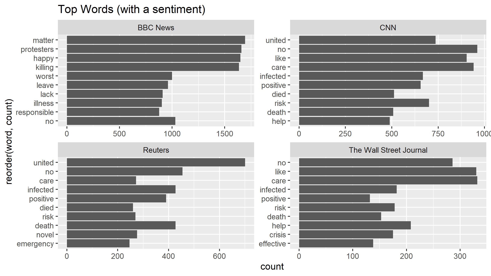
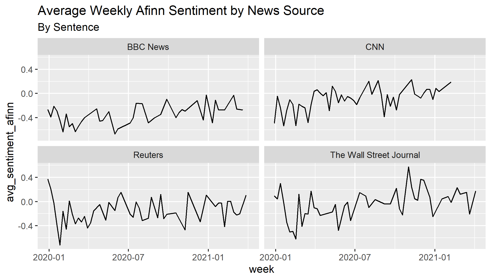

```{r, include=FALSE}
# not run
# setwd("C:/Users/apagta950/Documents/NYU/Courses/Spring 2021/MDML/Final Project/US-News-NLP/results")

library(knitr)
library(readr)

knitr::opts_chunk$set(fig.pos = "!H", out.extra = "")
model_results <- "../figures/gbm_results.csv"
```


# Preface

The full code and dataset can be found here: https://github.com/ajpag/US-News-NLP

All analysis was completed in R.

# Research Question

## Background

The means in which informaton is communicated with regards to the COVID-19 pandemic
has had major influence on how we read and learn about the virus through a multitude 
of media outlets. Some of these major sources include television, YouTube, social 
media forums, and major news companies. Major news companies in particular carry large
influence based on the audiences it can reach. For example, Fox News Channel 
averaged 2.5 million primetime viewers (8pm - 11pm) in February 2021, and CNN 
averaged 1.7 million during the same time period.
*Source: https://www.foxnews.com/media/fox-news-finishes-february-most-watched-primetime-network*.

Since major news companies have a large influence in how information is commmunicated 
to its audiences, it is vital to quantify how different these sources are in relation 
to COVID-19 news. By measuring potential bias in relation to each source, this 
analysis examines how different major news sources are when reporting on COVID-19.
It is also insightful to see if there are underlying patterns such as subtopics 
within COVID-19 that are published more in news sources over others. This would help 
identify if there are patterns that are predictive of which news source the article 
came from.

## Research Question

Are there underlying patterns in news articles related to COVID-19 across major news
sources that are suggestive of bias, and are these patterns predictive of which news 
source it is likely from?

## Use Cases

By quantifying underlying differences on COVID-19 reporting and examining the 
predictive power of these patterns to identify the news source, this study can be 
useful for a number of use cases. For example, understanding biases in article text 
can help the reader understand inherent idealogical leanings towards certain news 
sources, which can help equip them with greater understanding and critical 
examination of news consumption. From a policy perspective, greater impact and 
studies could be conducted to place more standardized regulations in an effort 
to influence more objective reporting. We acknowledge this second use case can 
be difficult from business and philosophical perspectives, especially in relation 
to the First Amendement of the US Constitution in relation to the freedom of speech.

## Methodology

### Data Sourcing

In order to choose major news sources to analyze, the figure below  created by 
the Pew Research Center shows where on the US political spectrum various 
news companies fall. In order to get a mix of sources across the conservative and 
liberal spectrum, while balancing limitations of computing resources, the following 
news sources were used to procure a dataset.


*Source: https://www.journalism.org/2014/10/21/political-polarization-media-habits/pj_14-10-21_mediapolarization-08/*

- BBC

- CNN

- The Wall Street Journal

- Reuters

*Note: Due to legal restrictions, Fox News data was not scraped*

```{r setup, include=FALSE}
setwd("C:/Users/apagta950/Documents/NYU/Courses/Spring 2021/MDML/Final Project/US-News-NLP/results")
knitr::opts_chunk$set(echo = TRUE)
```

# Data Cleaning

Leveraging the **[GNews API](https://gnewsapi.net/)**, news article data related 
to COVID-19 were pulled for the following major news sources noted in the 
previous section (filtered to US articles).

## GNews API

A total of 5,360 articles between the time period 1/1/2020 - 4/9/2021 were called from 
the API (20 articles per week and news source, for 67 weeks). The API call returned 
3,454 records for article-related data. Below are some of the key fields from the 
API call, with an example:

- ```article url```: https://www.cnn.com/2021/02/08/health/covid-19-antigen-tests-states-cnn-analysis/index.html

- ```article description```: "Covid-19 antigen tests not counted among cases in some
 states, CNN analysis shows - CNN "

- ```date and time of article publication```: 2021-02-08T08:00:00Z

- ```article source name```: CNN

## Web Scraping

After gathering the article URLs, the full news text for each article was pulled. Each
data source carried unique idiosyncrasies in its html structure. The next section 
highlights unique aspects web scraping each data source. 

### BBC


### CNN

There were two distinct HTML structures. One for the first sentence, and another 
for the remainder of the article. Additional cleaning needed to be done to remove 
the "(CNN)" text at the beginning of each article, as well as additional escape 
characters scattered throughout the article.

### Reuters

This was relatively streamlined compared to the other news sources. One unique 
aspect of Reuters was that a number of their articles were not text articles in the 
traditional sense, but slideshows. For example this article:

https://www.reuters.com/news/picture/coronavirus-outbreak-spreads-in-china-idUSRTS2ZART

### The Wall Street Journal

# Exploratory Data Analysis

## Sentiment Analysis

To better understand the data, sentiment analysis utilizing various lexicons were 
explored. Key visualizations of the data are illustrated:

BBC had the least average words per article, whereas CNN had the most words per 
article.


BBC News had a larger variety of top words compared to the other news sources.



All news sources had average weekly sentiment mainly hovering between -1 to 0, using 
the Afinn lexicon. This means that average sentiment was slightly negative.

The Wall Street Journal had the largest range in average weekly sentiment. It is 
plausible there is some correlation between this sentiment and the stock market, and
would require further analysis outside of this study.

*Afinn lexicon: https://www.tidytextmining.com/sentiment.html*



# Feature Engineering

In order to create features to build classification models for predicting a 
news source based on text, the below features were generated.

## Average Sentiment and Word counts

One feature was generated for each article:

- average sentiment by word
- average sentiment by sentence
- word count
- word count with a sentiment

## Keyword features

As a baseline, keyword features based on the researchers' prior knowledge on the 
following topics was used to generate average Afinn sentiment for articles. One 
feature was generated for each term below (noted in quotes).

- Politics: "Trump", "Biden"

- Business: "stock market", "financial"

- Pandemic: "Death", "Pandemic", "Disease", "Illness"

## Topic features from prior research

Leveraging prior studies, the following features were generated by topic using 
keyword. Specific keywords used for each topic can be found here:

https://github.com/ajpag/US-News-NLP/blob/53faa3e31d901386b12ea0459586ac6bd0785f1e/analysis/feature_engineering_ap.R#L280

Source: "Politicization and Polarization in COVID-19 News Coverage"
https://journals.sagepub.com/doi/full/10.1177/1075547020950735

- COVID 19

- Scientist

- Republican

- Democrat

Source: "Polarization in elite communication on the COVID-19 pandemic"
https://advances.sciencemag.org/content/6/28/eabc2717

- Republican Words

- Democrat Words

## Topic Modeling: Latent Dirichlet Allocation

To assess commonalities in topics and article text across articles, Latend
Dirichlet Allocation was applied. After experimentation, it was decided that 
7 topics was the optimal number, based on interpretabilty and overlap of topics. 
The VEM method was used: 
https://www.tidytextmining.com/topicmodeling.html

Topics:

```{r, echo=FALSE, warning=FALSE, message=FALSE}
library(knitr)
topics_ <- data.frame(topic_number = 1:7,
                      topic = c("Politics", "Reported deaths and cases",
                                "China / Wuhan", "Outbreaks and infections by country",
                                "Patients and Symptoms", "Vaccines and Research",
                                "Business and Economy"))
kable(topics_, caption = "Topics from LDA")

```


# Measuring Bias Across News Sources

Performing a chi-square test to measure differences in signifances across news sources,
the following metrics were used. The chi-square test for all three metrics suggest 
that there is a indeed a bias in article text across the news sources.

## Topic Probabilities

Following intuition, The Wall Street Journal has the highest average topic 
probability for Business and Economy articles. It is interesting that Reuters has 
the highest probability of China / Wuhan related articles. CNN has the lowest 
probability of articles pertaining to vaccines and research.

The chi-square test (*p < 1%*) indicates there are correlations across each news source in
relation to average topic probabilities.

*Note: Probabilities were multiplied by a factor of 100 prior to running the test*


## Average Sentiment

The chi-square test (*p < 1%*) indicates there are correlations across each news source 
in relation to average Afinn sentiment.

*Note: Sentiment scores were multiplied by a factor of 100 and converted to positive integers prior to running the test*


## Word Count


The chi-square test (*p < 1%*) indicates there are correlations across each news source 
in relation to average word count.

*Note: Average word counts were converted to positive integers prior to running the test*


# Classification

For each of the 5 algorithms run, 4 models were run using different sets of 
features:

- **Topic Modeling features**: per section 5.4 

- **Keyword features**: per section 5.2

- **Topic keyword features**: per section 5.3

- All features

```{r, echo=FALSE, warning=FALSE, message=FALSE}
kable(as.data.frame(read_csv(model_results)),
      caption = "Classification Model Results")
```


# Results

## Conclusion and Next Steps

## Limitations:
- Selection bias in news articles analyzed: Due to legal 
restrictions, more conservative news sources, such as Fox News, were not scraped.

- Context limitations in sentiment: The sentiment method used, Afinn, only parsed 
words individually, and not into context of the entire article. So, the sentence 
sentiment was calculated using the average sentiment of words.

- Parsing limitations: There are many edge cases in which breaking down 
articles by sentences did not parse successfully. For example, 
```tidytext::unnest_functions()``` incorrectly parsed the following sentence into 
two since ```Ms.``` has a period: 

Original sentence:
```"The manager's decision to send Ms. Coleman home for wearing the headscarf was due to a lack of training," Warren said.```

Parsed sentence(s)

- ```"The manager's decision to send Ms."```

- ```"Coleman home for wearing the headscarf was due to a lack of training," Warren said."```
